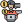

 

 

# Önce Reklam 😁😁

Reklamlar.... Hanımların dikkatine hem tasarım hemde yazılım makinesi ayağınıza geldi...😂

Kendinize özel bir tasarıma sahip statik bir web sitesi yaptırmak mı istiyorsunuz? Ama bunun için hem tasarımcı hemde yazılımcı ile anlaşmanız mı gerekiyor? Artık gerekmiyor. Ben Musa Yazlık isteklerinize uygun olarak sadece size özel olan statik web sitenizin tasarımını figma üzerinde yaptıktan sonra html5,css3(scss) ve javascript dillerini kullanarak seo'ya uygun kodlama ile statik web sitenizi yapabilirim. İletişim için aşağıdaki bağlantıları kullanabilirsiniz.

  

# Yazılımcılar İçin Ücretsiz Faydalı Kaynaklar (v1.1)

Herkese merhabalar.🖐 Söze nasıl başlayacağımı bilemedim. Şöyle kısaca kendimden bahsettikten sonra depo ile ilgili bilgiler vereyim diyorum nasıl olur?😁 İsmim Musa Yazlık. 24 yaşındayım. Erciyes üniversitesi kayseri meslek yüksek okulu Bilgisayar programcılığı mezunuyum. Kendimi 2017 yılının haziran ayından bu yana web tasarım ve web yazılım alanında geliştirmekteyim. Şu anda ise hobi amaçlı figma öğreniyorum ve tasarımlar yapıyorum. Uzmanlık olarakta Web alanının Frontend tarafında kendimi geliştirmeye devam ediyorum. 

Şimdi depo ile ilgili bilgi verirsem. Dediğim gibi 2017 yılının haziran ayından bu yana web alanı ile uğraşıyorum. Bu geçen 4 yılda çok fazla araştırma yaptım,kaynak topladım. Tabi bu kaynakları şimdiye kadar kendim faydalanmak amaçlı topladığım için pek bir düzenli topladığım söylenemez. Bu depo ile hem o düzeni oturtturmak istiyorum hemde benim sahip olduğum kaynaklara genç yazılımcılarında kolay bir şekilde ulaşmasını istiyorum. 

 

## Bu depoda ne gibi şeyler olacak?
Web tasarım ve web tasarım ile ilgili ücretli,ücretsiz her türlü kaynak olacak desem çok sade bir cevap olur sanırım. Ben bir kaç madde ile olacaklardan bahsedeyim.

1. 🏫 Udemy eğitimlerini çekiliş ile veren veya direk olarak ücretsiz olarak yayınlayan instagram hesapları ve telegram grupları. (Ben bu sayede 570 den fazla eğitime ücretsiz sahip oldum.)
2. 👨‍👧‍👦 Her yazılımcının katılması gereken discord ve telegram grupları.
3. 🔖 Tarayıcıda bulunan bookmark(yer imi, yer işaretleri). (Bunun içinde bir bir türlü site. Html,Css,Javascript,Php ile ilgili topladığım tüm siteleri paylaşacağım)
4. #️⃣ Yaptığınız projeleri demo link olarak paylaşabileceğiniz siteler.
5. #️⃣ Her yazılımcının takip etmesi gerektiği siteler.
6. 🎓 Üniversite öğrencileri için ücretsiz olan kaynaklar.
7. #️⃣Tarayıcıda kullandığım eklentiler.
8. 🤑 Para kazanabileceğiniz freelance siteler.
9. ▶️ Takip ettiğim Youtube kanalları.
10. 🧔 Mentör desteği alabileceğiniz ücretli **ücretsiz** siteler gruplar.
11. 🤩 Daha daha birçok şey var... 🤩

 

##   Takip Ettiğim İnstagram Hesapları
Ücretsiz udemy eğitimlerine takip ettiğim instagram hesaplarından ve üye olduğum telegram gruplarından elde ediyorum. Takip ettiğim instagram hesaplarının çekilişlerine katılmıyorum sadece hikayelerinde ücretsiz bir kurs paylaştıklarında hemen kapıyorum.😅 Tabi sadece udemy kursu kapmak için takip etmiyorum. Bu takip ettiğim hesaplar web tasarım,web yazılım veya girişimcilik ile ilgili paylaşımlarda yapıyorlar. Onlarda hoşuma gidiyor. Normalde artık instagram hesabımı aktif bir şekilde kullanmıyorum ama isterseniz [buraya](https://www.instagram.com/musa_yazlik/) tıklayarak beni takip edebilirsiniz.😁

1. [workshoperscomm](https://www.instagram.com/workshoperscomm/) : Bolca ücretsiz ve sertifikalı online eğitim veren bir kuruluş. 
2. [girisimcikafasi](https://www.instagram.com/girisimcikafasi/) : Girişimcilikle ilgili motivasyon ve öneri içerikleri paylaşan bir hesap.
3. [algoritmikfikir](https://www.instagram.com/algoritmikfikir/) : Yazılım alanı ile ilgili genelde bilgi içerikleri paylaşan bir hesap.
4. [yazilimoji](https://www.instagram.com/yazilimoji/) : Yazılım alanı ile ilgili bilgi ve komik içerikler paylaşan bir hesap.
5. [yazilimkafasi_](https://www.instagram.com/yazilimkafasi_/) : Yine yazılım alanı ile ilgili küçük kod parçacıkları,bolca kendi ortamını ve motivasyon içeriği paylaşan bir hesap.
6. [kod.efendi](https://www.instagram.com/kod.efendi/) : Yazılım alanı ile ilgili bilgi içerikleri paylaşan bir hesap.
7. [kerokod](https://www.instagram.com/kerokodcom/) : Yazılım alanı ile ilgili bilgi,motivasyon ve komik içerikler paylaşan bir hesap.
8. [seyyar.tasarimci](https://www.instagram.com/seyyar.tasarimci/) : Freelance olarak çalışan bir tasarımcı. Yaptığı iş ile ilgili bilgi içerikleri paylaşıyor.
9. [prototurk.official](https://www.instagram.com/prototurk.official/) : Tayfun erbilen i bilmeyen yoktur her halde. 😀 Web yazılım ile ilgili içerikler paylaşıyor.
10. [tolgahan.webdev](https://www.instagram.com/tolgahan.webdev/) : Web yazılım alanı ile ilgili bolca içerik paylaşan bir hesap.
11. [codemvia](https://www.instagram.com/codemvia/) : Mentör veya menteeleri birleştirmek amaçlı kuruşmuş bir kuruluştur. Mentörlük hizmeti ücretsizdir.
12. [luisdanielroviracontreras](https://www.instagram.com/luisdanielroviracontreras/) : Yapmış olduğu tasarımları kodları ile paylaşan bir hesap.
13. [siber_ybs](https://www.instagram.com/siber_ybs/) : Yazılım ile ilgili genelde komik içerikler paylaşan bir hesap.
14. [kodlarintercumani](https://www.instagram.com/kodlarintercumani/) : Yazılım ile ilgili bilgi içerikleri paylaşan bir hesap.
15. [btkakademi](https://www.instagram.com/btkakademi/) : Btk akademinin resmi instagram hesabı. Bazen eğitmenler ile de canlı yayın yapılmakta.
16. [kodmuhendisi](https://www.instagram.com/kodmuhendisi/) : Yazılım ile ilgili bilgi içerikleri paylaşan bir hesap.
17. [yazilimturk](https://www.instagram.com/yazilimturk/) : Bilgi ve mizah odaklı paylaşımlar yapan bir yazılım toplulugudur.
18. [yazilimtoplulugu](https://www.instagram.com/yazilimtoplulugu/) : Yazılım ile ilgili komik içerikler paylaşan bir hesap.
19. [yazilimci.genclik](https://www.instagram.com/yazilimci.genclik/) : Yazılım ile ilgili komik,bilgi ve motivasyon içerikleri paylaşan bir hesap.
20. [kodrehberi](https://www.instagram.com/kodrehberi/) : Yazılım ile ilgili komik,bilgi ve motivasyon içerikleri paylaşan bir hesap.
21. [gencyazilimci](https://www.instagram.com/gencyazilimci/) : Yazılım ile ilgili komik içerikler paylaşan bir hesap.
22. [yazilimci.adamm](https://www.instagram.com/yazilimci.adamm/) : Yazılım ile ilgili komik,bilgi,motivasyon ve gündem içerikleri paylaşan bir hesap.
23. [endertopaloglu](https://www.instagram.com/endertopaloglu/) : Aktif olarak instagram hesabında içerik paylaşmıyor ama youtube kanalına bakmanızı öneririm. Usta bir tasarımcı. Tasarım babası. 😂
24. [kerimcanyektekcom](https://www.instagram.com/kerimcanyektekcom/) : Karekod un kurucusu.
25. [uxswipe](https://www.instagram.com/uxswipe/) : Tasarım ile ilgili bilgi içerikleri paylaşan bir hesap.
26. [ui8net](https://www.instagram.com/ui8net/) : UI ile ilgili tasarımlar paylaşan bir hesap.
27. [web.talk](https://www.instagram.com/web.talk/) : Taarım ile ilgili bilgiler paylaşan bir hesap.
28. [uiturkiye](https://www.instagram.com/uiturkiye/) : Tasarım ile ilgili bilgiler dosyalar paylaşan hesap. Bu arada içerikler türkçe.😁
29. [interfacely](https://www.instagram.com/interfacely/) : Tasarım örnekleri ve o örnekte kullanılan yapılar ile ilgili içerikler paylaşan bir hesap.
30. [ux.ferdicildiz](https://www.instagram.com/ux.ferdicildiz/) : Uzman bir tasarımcı. Youtube kanalına bakmanızı öneririm.
31. [designspective](https://www.instagram.com/designspective/) : Tasarım ile ilgili içerikler paylaşan bir hesap.
32. [uidacozeriz](https://www.instagram.com/uidacozeriz/) : Bazı firmaların ui tasarımlarını inceleyen bir hesap. Youtube kanallarına bakmanızı öneririm. 
33. [afshint2y](https://www.instagram.com/afshint2y/) : Severek takip ettiğim bir grafik tasarımcısı. İconset lerini kullanıyorum bolca tasarımlarımda.
34. [amirbaqian](https://www.instagram.com/amirbaqian/) : Bir üsteki ile aynı.
35. [awsmd_com](https://www.instagram.com/awsmd_com/) : Tasarım ile ilgili içerikler paylaşan bir hesap.
36. [ui_gradient](https://www.instagram.com/ui_gradient/) : Tasarım ile ilgili bilgi içerikleri paylaşan bir hesap.
37. [ademilter](https://www.instagram.com/ademilter/) : Severek takip ettiğim bir yazılımcı. İnstagram hesabını kişisel içerikler paylaşmak için kullanıyor. Youtube kanalına bakmanızı öneririm. 
38. [ux.base](https://www.instagram.com/ux.base/) : UX ile ilgili bilgi içerikleri paylaşan bir hesap.
39. [uxbucket](https://www.instagram.com/uxbucket/) : UX ile ilgili bilgi içerikleri paylaşan bir hesap.
40. [qclaydesign](https://www.instagram.com/qclaydesign/) : Tasarım ile ilgili içerikler paylaşan bir hesap.
41. [uiuxdailytips](https://www.instagram.com/uiuxdailytips/) : UI ve UX ile ilgili bilgiler paylaşan bir  hesap.
42. [coding_gyan_](https://www.instagram.com/coding_gyan_/) : Yazılım ile ilgili içerikler paylaşan bir hesap.
43. [coding.beast](https://www.instagram.com/coding.beast/) : Yazılım ile ilgili içerikler paylaşan bir hesap.
44. [ahmetekincicomtr](https://www.instagram.com/ahmetekincicomtr/) : Dijital içerik üreten bir hesap.
45. [ravi.graphicdesigner](https://www.instagram.com/ravi.graphicdesigner/) : Tasarım ile ilgili içerikler paylaşan bir hesap.
46. [grafikirfan](https://www.instagram.com/grafikirfan/) : Takip ettiğim bir grafik tasarımcısı.
47. [talha.creative](https://www.instagram.com/talha.creative/) : Severek takip ettiğim bir UI/UX Tasarımcısı. Güzel içerikler paylaşıyor. Söylemeden geçemeyeceğim.
48. [busra.ui](https://www.instagram.com/busra.ui/) : Güzel içerikler paylaşan bir tasarımcı.
49. [developer_nikhil27](https://www.instagram.com/developer_nikhil27/) : Güzel içerikler paylaşan bir frontend developer.
50. [ankitcreatives](https://www.instagram.com/ankitcreatives/) : Tasarımcılar için takip etmesini önerdiğim bir instagram hesabı.
51. [designill4u](https://www.instagram.com/designill4u/) : Yine takip ettiğim bir tasarımcı instagram hesabı. 
52. [thalion_pb](https://www.instagram.com/thalion_pb/) : Tasarım ile ilgili içerikler paylaşan bir hesap.
53. [ariqchowdhury.uiux](https://www.instagram.com/ariqchowdhury.uiux/) : Tasarım ile ilgili içerikler paylaşan bir hesap.
54. [bydanromero](https://www.instagram.com/bydanromero/) : Tasarım ile ilgili içerikler paylaşan bir hesap.
55. [satyam.js](https://www.instagram.com/satyam.js/) : Yazılım ile ilgili içerikler paylaşan bir hesap.
56. [onlysiamak](https://www.instagram.com/onlysiamak/) : Yazılım ve tasarım ile ilgili içerikler paylaşan bir hesap.
57. [ui__ux](https://www.instagram.com/ui__ux/) : Tasarım ile ilgili içerikler paylaşan bir hesap.
58. [lubnadev](https://www.instagram.com/lubnadev/) : Web yazılım ile ilgili içerikler paylaşan bir hesap.
59. [janm_ux](https://www.instagram.com/janm_ux/) : Tasarım ile ilgili içerikler paylaşan bir hesap.
60. [orix.agency](https://www.instagram.com/orix.agency/) : Tasarım ile ilgili içerikler paylaşan bir hesap.
61. [uxcel.app](https://www.instagram.com/uxcel.app/) : Tasarım ile ilgili içerikler paylaşan bir hesap.
62. [michael.filipiuk](https://www.instagram.com/michael.filipiuk/) : Tasarım ile ilgili içerikler paylaşan bir hesap. 
63. [thewebdeveloper_](https://www.instagram.com/thewebdeveloper_/) : Web yazılım ile ilgili içerikler paylaşan bir hesap.
64. [themizko](https://www.instagram.com/themizko/) : Web tasarım ile ilgili içerikler paylaşan bir hesap.
65. [ui.colour](https://www.instagram.com/ui.colour/) : Daha çok renkler ile ilgili içerikler paylaşan bir hesap.
66. [ransegall](https://www.instagram.com/ransegall/) : Tasarım ile ilgili içerikler paylaşan bir hesap. 
67. [colours.cafe](https://www.instagram.com/colours.cafe/) : Renk uyumluluğu ile ilgili renk kitleri paylaşan bir hesap.
68. [uxbrainy](https://www.instagram.com/uxbrainy/) : Tasarım ile ilgili içerikler paylaşan bir hesap. 
69. [wilycoder](https://www.instagram.com/wilycoder/) : Genelde web yazılım ile ilgili bilgilendirici içerikler paylaşan bir hesap.
70. [kod_evreni](https://www.instagram.com/kod_evreni/) : Yazılımcı bir abimiz. 😀 Genel anlamda kişisel paylaşımlar yapan bir hesap.

 

##  Üye Olduğum Telegram Grupları

1. [Yazılım Topluluğu](https://t.me/yazilimtoplulugu)
2. [Kablosuzkedi](https://t.me/joinchat/Jg9BelVAU4OspsJtCrRSxA)
3. [YazılımTürk 🇹🇷](https://t.me/yazilimturkiye)
4. [Yazılım Eğitim](https://t.me/yazilimegitimlaravel)
5. [./prototurk](https://t.me/prototurk)
6. [Laravel İstanbul](https://t.me/laravelistanbul)
7. [Sadık Turan](https://t.me/sadikturancom)
8. [Geleceğini Tasarlayanlar](https://t.me/geleceginitasarlayanlar)
9. [FULL STACK DEVELOPERS](https://t.me/fullstackdevelopersa)
10. [Kod Rehberi](https://t.me/kodrehberi)
11. [ReactJS Turkey](https://t.me/turkeyreactjs)
12. [Yazılım İş İlanları](https://t.me/yazilimisilanlarigrubu)
13. Vue.js & Nuxt.js
14. [Yazılımcı Gençlik](https://t.me/yazilimcigenclik)
15. [#herkesicinegitim](https://t.me/herkesicinegitim)
16. Codemvia Frontend Devs
17. [Donanım & Bilgisayar Sorunları](https://t.me/k_donanimyardimlasma)
18. Askıda Eğitim 📚
19. [İLETİŞİM - SEYYAR TASARIMCI ⭐️](https://t.me/seyyariletisim)
20. [Yazılım Yardımlaşma](https://t.me/k_yazilimyardim)
21. [KEROKOD KÜTÜPHANE 📚](https://t.me/kerokodcom)
22. [Codem<ia Topluluğu](https://t.me/codemvia)
23. [Tasarım Yardımlaşma](https://t.me/k_tasarimyardimlasma)
24. [Seo Yardımlaşma](https://t.me/k_seoyardimlasma)
25. Hayallerini Kodlayanlar - mstfkrtll
26. [KodRehberi Kaynak](https://t.me/kodrehberi_kaynak)
27. [Türkçe Kaynaklar Kanalı](https://t.me/trkaynak)

 

##   Abone Olduğum Youtube Kanalları

Güzel bir bölüme geldik. Siz yapıyor musunuz bilmiyorum ama ben her hafta 1 saatimi "Html,css,javascript design" gibi kelimeleri kullanarak youtube da yeni kanallar bulmaya çalışıyorum. Bulduklarıma da abone oluyorum. Ben yaklaşık 100 kanala abone olmuşumdur diye düşünüyordum. Ama tamı tamına 224 kanala abone olmuşum. Vay canına 😅. Bu kanalların Web tasarım ve Web yazılım ile ilgili kanallar. Ama aralarında farklı kanallarda var. Her zaman yazılım olmuyor birazda eğlenmek şart. 😁

1. [Abdullah Zübeyir Yıldız](https://www.youtube.com/channel/UCvFLUyaAeagGWj_1eEkoOmA)
2. [Academind ](https://www.youtube.com/channel/UCSJbGtTlrDami-tDGPUV9-w)
3. [ACM HACETTEPE](https://www.youtube.com/user/HacettepeAcm)
4. [Adem Ilter](https://www.youtube.com/user/ademilter)
5. [Adrian Twarog](https://www.youtube.com/channel/UCvM5YYWwfLwpcQgbRr68JLQ)
6. [Ahmet Buğra Çakıcı](https://www.youtube.com/user/EqualGameTR)
7. [Ahmet Rende](https://www.youtube.com/channel/UC7DDkGdctG5vllozVEv5q1w)
8. [AHP Tech](https://www.youtube.com/channel/UCfhNDfFM1gsfkWTgoySnkVw)
9. [Alessandro Castellani](https://www.youtube.com/user/williamprey)
10. [Alper Akyüz](https://www.youtube.com/user/akyuzalper)
11. [Alperen Ertürk](https://www.youtube.com/channel/UCBKyWBZpVV4Awhqc2yWvFVQ)
12. [Animation Coding](https://www.youtube.com/channel/UCnzIhXjOKIOgB3nIdOKJshQ)
13. [Arin Yazilim](https://www.youtube.com/channel/UCzVB3qcyTd-QGJKY_Hpky5g)
14. [Armağan Amcalar](https://www.youtube.com/channel/UCANCsbie9EorvBNWfpVntGQ)
15. [Armağan Gökçe](https://www.youtube.com/channel/UCDFaMrjP6ZZdouZmtpvzDrQ)
16. [ArmyYazılım](https://www.youtube.com/channel/UCfErC90miCKTWAyQUDx_vmA)
17. [Atetax Software](https://www.youtube.com/channel/UCl9mmI1BWp5dgaXSHADA7YA)
18. [Atil Samancioglu](https://www.youtube.com/channel/UCnmAu7FF7LeoyTozrMVtTxQ)
19. [AYBÜ BİLTEK - Bilim ve Teknoloji Topluluğu](https://www.youtube.com/user/ybubiltek)
20. [Barış Özcan](https://www.youtube.com/user/b31416)
21. [Batuhan Zorbey Zengin](https://www.youtube.com/channel/UC7aWir_ZXWIsR5C19R9rqXw)
22. [Bedimcode](https://www.youtube.com/channel/UCgkDs77BoEhMIgRUB4MKrtQ)
23. [Berke Küsmenoğlu](https://www.youtube.com/channel/UCDgxxlq9jR3H7jPT2wLMvfw)
24. [BEST AKADEMİ](https://www.youtube.com/channel/UCO4pF0jV9lSsl6Lh_pOTUTg)
25. [bestcloudforme](https://www.youtube.com/channel/UCC5QWJKPzzLFuggLqWAjhiw)
26. [Bewakuf Designer](https://www.youtube.com/channel/UCDHVxE8Gs34Nm87ucklaU-g)
27. [bidoluyazılım](https://www.youtube.com/channel/UCtpWvRbVdndZSWuY7sdlhAA)
28. [Bilgisayar Genetiği](https://www.youtube.com/channel/UCgZOWIieKTtemNhAa-3S0Ow)
29. [Bilgisayar Mühendisliği](https://www.youtube.com/channel/UC-PNIxulvuf0nNyvXXOO0FA)
30. [Bitfumes](https://www.youtube.com/channel/UC_hG9fglfmShkwex1KVydHA)
31. [bmakukariyer](https://www.youtube.com/channel/UCy-dmeLmvjwndla4g7QhK_Q)
32. [BookMark Code](https://www.youtube.com/channel/UCtoBjWAGbdlf9FdeQF3Be9Q)
33. [Brian Design](https://www.youtube.com/channel/UCsKsymTY_4BYR-wytLjex7A)
34. [Bro Jenuel](https://www.youtube.com/channel/UCNANDtTF63UTRcYioVsSCdA)
35. [BTK Akademi](https://www.youtube.com/channel/UCIeLKRrvnkBn0xEvbKzRfEg)
36. [Burak Doğan](https://www.youtube.com/channel/UCk1y8YhJPqQRE2L3Z6Lk-Ag)
37. [Buğra & Aybars AYAN](https://www.youtube.com/user/bgryn1)
38. [Buğra Yazar](https://www.youtube.com/channel/UCHGZy5SU-9GjEm_iqpvoNyg)
39. [Can Deger](https://www.youtube.com/user/theblaxx)
40. [Can Gökçeaslan](https://www.youtube.com/user/humanbeingchannel)
41. [ChornyGlaza](https://www.youtube.com/channel/UCKiQW48QhB-N5cVIvfgWutg)
42. [Chris Coyier](https://www.youtube.com/user/realcsstricks)
43. [cihan koc](https://www.youtube.com/user/cihankoc41)
44. [CODE HASH](https://www.youtube.com/channel/UCBCn4Y4JFhdsqs2P4jNweLQ)
45. [Code Of The Day](https://www.youtube.com/channel/UCY0vB5CVtzvUJVlfHWCzk4A)
46. [Code Resource](https://www.youtube.com/channel/UC7mvKPmVXDsECEpmAWENPlw)
47. [codefoxx](https://www.youtube.com/channel/UCvi0rWTSkJkrunfhXH0tYuA)
48. [Codeigniter Hocası](https://www.youtube.com/channel/UC_ZleZYOmiqdaGnDpIcqjoQ)
49. [CodeInFarm](https://www.youtube.com/channel/UC5epiUXRW-oZunQeDS2WdiQ)
50. [Coder in Chief](https://www.youtube.com/channel/UCAG49-Eryoxh7DHeiMqkvnQ)
51. [codevo](https://www.youtube.com/channel/UCRITDeojq9IsQfTWPeJ-pDQ)
52. [Codic Gyan](https://www.youtube.com/channel/UCn1qNvXfy3pFQ411vKaDirA)
53. [Coding Artist](https://www.youtube.com/channel/UC15exV5s79D_aYGADudlwpQ)
54. [Coding Circle](https://www.youtube.com/channel/UCZ2a0BhmNhA53yWGksLDLtg)
55. [Coding Gyan](https://www.youtube.com/channel/UCGFGKQcZUry26sLjX6ERjqA)
56. [Coding Market](https://www.youtube.com/channel/UCtVM2RthR4aC6o7dzySmExA)
57. [Codingflag](https://www.youtube.com/channel/UCXDLrsqe14uFu6k96xjlF4w)
58. [CodingLab](https://www.youtube.com/channel/UCBlr2jG1onljL-gUy9bbhJwCodingLab)
59. [CodingNepal](https://www.youtube.com/channel/UCk7xIEmd3MeyhIu2StLX5yA)
60. [codingwithdidem](https://www.youtube.com/channel/UCfGXEo2uCkVqcIqkIaFNGcA)
61. [Computer Code](https://www.youtube.com/channel/UCabqdqPbjR79eM5kNQS4B3Q)
62. [Çay Kahve İnsan](https://www.youtube.com/channel/UCD37i3UdHYc9MJ1MnuQ6n2Q)
63. [DarkCode](https://www.youtube.com/channel/UCD3KVjbb7aq2OiOffuungzw)
64. [Daron Yondem](https://www.youtube.com/user/daronyondem)
65. [dcode](https://www.youtube.com/channel/UCjX0FtIZBBVD3YoCcxnDC4g)
66. [DeepLab.Bootcamp](https://www.youtube.com/channel/UCgVXoTdkkhjWaceF0c7FePg)
67. [Demet Tuncer](https://www.youtube.com/channel/UCZFxYUEMCctTUas2fUTSdug)
68. [Design Medium](https://www.youtube.com/channel/UCz-1_EkgB8In_DsS2hYaeWw)
69. [DesignCourse](https://www.youtube.com/user/DesignCourse)
70. [DesignGost](https://www.youtube.com/channel/UCMLbZZElW190lLG6YlAE61Q)
71. [Designus](https://www.youtube.com/user/designusnet)
72. [Dev Dev Show](https://www.youtube.com/channel/UChh-hnHYOsoBOaniQucV_0g)
73. [Dev Ed](https://www.youtube.com/channel/UClb90NQQcskPUGDIXsQEz5Q)
74. [Divinector](https://www.youtube.com/channel/UCki4IDK86E6_pDtptmsslow)
75. [Easy Tutorials](https://www.youtube.com/channel/UCkjoHfkLEy7ZT4bA2myJ8xA)
76. [EGE SABAHCI](https://www.youtube.com/channel/UCKHzCV9EIIqQQZVVw5VwxTA)
77. [egirişim](https://www.youtube.com/channel/UCb-LRmmw_klCTax93YJPlXA)
78. [Emrah Yüksel](https://www.youtube.com/channel/UC2u9Gc37Rq44dB3mW4Kdi-w)
79. [Emrah Öz](https://www.youtube.com/user/emr550m)
80. [Ender Topaloğlu](https://www.youtube.com/user/endertopaloglu)
81. [Enes Tuzlu](https://www.youtube.com/user/enestuzlu)
82. [Engin Demiroğ](https://www.youtube.com/channel/UCRjiquPh4mjPNoOV9eCilXQ)
83. [Eren Alkış](https://www.youtube.com/user/erenalkistv)
84. [Erhan Kahraman](https://www.youtube.com/channel/UCuW0Lci5XcskmRr4vG6l_fA)
85. [FalconMasters](https://www.youtube.com/user/FalconMasters)
86. [Fatih Acet](https://www.youtube.com/channel/UCvANtNYHe556zUWm6VzJenQ)
87. [Fatih Girgiç](https://www.youtube.com/channel/UCop2fafOS6_HI_J6P-OkRMA)
88. [Fatih Şenol](https://www.youtube.com/channel/UCWkTr5b9h8ZcVkDS_GbC1eg)
89. [Fehmi UYAR](https://www.youtube.com/channel/UCBdyRvz9ixmNWHwj4cCiuHA)
90. [Ferdi Cildiz](https://www.youtube.com/user/FerdiCildizNet)
91. [FK LANGUAGE](https://www.youtube.com/channel/UCFct4bf2mKCT7gP0lz7RuJw)
92. [Florin Pop](https://www.youtube.com/channel/UCeU-1X402kT-JlLdAitxSMA)
93. [Franks laboratory](https://www.youtube.com/channel/UCEqc149iR-ALYkGM6TG-7vQ)
94. [Fransix Web](https://www.youtube.com/channel/UC3htjEhdtx9DjpGDv-dur1w)
95. [freeCodeCamp.org](https://www.youtube.com/channel/UC8butISFwT-Wl7EV0hUK0BQ)
96. [Funda İydir](https://www.youtube.com/channel/UCwRcFwA20JCzjPmGT1yoi_g)
97. [GDG & WTM Tekirdağ](https://www.youtube.com/channel/UCryqR35g2y0QSzK3Oxv9unA)
98. [GDG / WTM Kirklareli](https://www.youtube.com/channel/UCdWgGVPLtil54EcYiuKFSFQ)
99. [GDG Istanbul](https://www.youtube.com/user/GDGIstanbul)
100. [GDG&WTM Kayseri](https://www.youtube.com/channel/UCktg5uv7yJKSmg_Gf4UBRow)
101. [Going-To Internet](https://www.youtube.com/channel/UCfNzft_txAamoQvwh1j2HEQ)
102. [Google Developer Communities Turkey](https://www.youtube.com/channel/UCwHGWX8X0TqGXMb-Q_GkmPg)
103. [GTU Bilgisayar Topluluğu](https://www.youtube.com/channel/UCEwjKZ6jYATvvfNx_9AzUYw)
104. [GYGRUP - Youtube](https://www.youtube.com/channel/UCexK9Eh8BS7_nzzvA-ROPhg)
105. [Hakan Ertan](https://www.youtube.com/channel/UCfrO4EyEc3N5TaunnfX1uHQ)
106. [halil ibrahim yavuz](https://www.youtube.com/channel/UCCNjBfg9Dmy2EUYScm5kOdg)
107. [hasan gürsan](https://www.youtube.com/channel/UCgkboBS_r4mNaZ7FY5Scl0w)
108. [Hikmet Anıl Öztekin](https://www.youtube.com/channel/UCr6x-Nmvmbr3BbZyYAbHFDg)
109. [How 2 Create](https://www.youtube.com/channel/UCgG-viwZXSwY5Ef79DBoJGw)
110. [I Make Design Easy](https://www.youtube.com/channel/UCXRcnBzNTCVgdx98cjXP7AA)
111. [Innovation Teach](https://www.youtube.com/channel/UCQzIM5rkVXGH0Z_OSf0DjoA)
112. [JavaScript Mastery](https://www.youtube.com/channel/UCmXmlB4-HJytD7wek0Uo97A)
113. [Jesse Showalter](https://www.youtube.com/user/JesseAtomic)
114. [Julio Codes](https://www.youtube.com/channel/UCeHWTyAKBv_WnW8gsEKGECw)
115. [K2classroom](https://www.youtube.com/channel/UChR_K42Pwp-ssMlKENjU6ug)
116. [kablosuzkedi](https://www.youtube.com/channel/UCYT5QTr38bwp85Pka8YSVIg)
117. [KeroKOD](https://www.youtube.com/channel/UC4-ZzmUzjOwgsM2QzH1VlSg)
118. [Kod Günlüğüm](https://www.youtube.com/user/konelakrep)
119. [KODAKTIF VIDEO EGITIM](https://www.youtube.com/channel/UCgSYwr_wOQQ6UHhpZ81HbUQ)
120. [Kodla Ogren](https://www.youtube.com/channel/UCqa_n2-IFnS9_iXr2QFrrAA)
121. [Kodluyoruz](https://www.youtube.com/channel/UCSnIf-v95OSGIv9H7d2R2lw)
122. [Koray SADIKLAR](https://www.youtube.com/user/koraysadiklar)
123. [Laravel Daily](https://www.youtube.com/channel/UCTuplgOBi6tJIlesIboymGA)
124. [LearnCode.academy](https://www.youtube.com/user/learncodeacademy)
125. [LearnDesign](https://www.youtube.com/channel/UCWCcoBXOXpNMg0p8Qrn2l0g)
126. [LearnWebCode](https://www.youtube.com/user/LearnWebCode)
127. [Mahallenin Yazılımcısı](https://www.youtube.com/channel/UC7o8YL53bz86ssXKJXFpa-g)
128. [Make Coding Easier](https://www.youtube.com/channel/UCiEVvaV8O6VBKzU3d7ezKGg)
129. [Mehmet Ali FIRAT](https://www.youtube.com/channel/UCWTvpZqXA6_HXCtiEaM4Tcw)
130. [Mehmet Online](https://www.youtube.com/channel/UCrAOSVmNndTeLdBtnDmBhvA)
131. [Mert Buldur](https://www.youtube.com/channel/UCFpBJaxOXeVa1mvPao-2aLA)
132. [Mert ÖZEN](https://www.youtube.com/channel/UCxSgy7kAjD5r9zXMxt9DtAQ)
133. [MinzCode](https://www.youtube.com/channel/UCknjk_lWCHNT1UFBGCgHTdg)
134. [Mohammad Rakib](https://www.youtube.com/channel/UCgjIzFwnjt1vXEg-_BDN8fw)
135. [moradam](https://www.youtube.com/channel/UCHLmyqWRQ9XW0thbQq-sGjw)
136. [Mr Digital](https://www.youtube.com/user/MrDigitalAu)
137. [Mr. Web Designer](https://www.youtube.com/channel/UCKwgH3vASrD2brd1l2m6NHw)
138. [Muhammet İlbaş](https://www.youtube.com/channel/UCMapv0sUGvAeEUaWgaZch-w)
139. [Mustafa Değirmenci](https://www.youtube.com/channel/UCmPKzwGKe2a_vK69-8SDRJg)
140. [Mustafa Filiz](https://www.youtube.com/channel/UCQCJZRZB1mYEhhrLNeSyBIw)
141. [nezihi gözen](https://www.youtube.com/user/nezihig)
142. [OctAcademy](https://www.youtube.com/channel/UCVO85fbcuI-726-aNVErDmA)
143. [Okan DAVUT](https://www.youtube.com/channel/UCD9xZqZn8YHkm-6XnmdgYGg)
144. [Omer Celikel](https://www.youtube.com/channel/UCCubrWlPc0zdjwX9Zidcikw)
145. [Online Tutorials](https://www.youtube.com/channel/UCbwXnUipZsLfUckBPsC7Jog)
146. [Online web ustaad](https://www.youtube.com/channel/UC8xTHK97Ng__KZvGcO_K7CA)
147. [Orhan Dogan](https://www.youtube.com/channel/UCCwi_-ersVpqI4w3vO57Tbg)
148. [Ozan Teoman Dayanan](https://www.youtube.com/channel/UCtht0fonJ_S6FabMubMlRuA)
149. [Oğur UYANIK](https://www.youtube.com/channel/UCWBBwkcNpfJeIHutK_-_VpQ)
150. [Paradox Way](https://www.youtube.com/channel/UC0A9XHs9WIxr7ZqJAXgLZZA)
151. [Paylaştıkça](https://www.youtube.com/channel/UCcbUpEFVm5HeIJDDU7p3DXw)
152. [Penguin Digital](https://www.youtube.com/channel/UCaQqYZ-ZyYbD0C5DJSGdVIg)
153. [PHP Türkiye](https://www.youtube.com/channel/UCx-9IKA7PUFHi-qz0BN1kqQ)
154. [pixeladam](https://www.youtube.com/channel/UCGTsT_WyH8BP2sBNEmyzaMg)
155. [povodu](https://www.youtube.com/channel/UC8Iop0xtHvIiPUxlW3nxDbw)
156. [Prisync Labs](https://www.youtube.com/channel/UCAYAwQ-SKG2-o4c5UQcitTQ)
157. [PROTOTURK](https://www.youtube.com/user/uzmanvideo)
158. [RaddyTheBrand](https://www.youtube.com/channel/UCvXscyQ0cLzPZeNOeXI45Sw)
159. [Raptiye](https://www.youtube.com/channel/UCcPpemmsaWJrX9JY_tTfBAQ)
160. [Sadık Bahadır Memiş](https://www.youtube.com/channel/UCRMr1v2WFJsP0UWbcxn2N9A)
161. [Sadık Turan](https://www.youtube.com/user/sadikturan41)
162. [Sanagrafi](https://www.youtube.com/channel/UC7V5OLL3CjoHz6t6XpNRFKg)
163. [sanalonyedi](https://www.youtube.com/channel/UCSCKbkedqGQHuU6IYNG6WSw)
164. [Selahattin Ünlü](https://www.youtube.com/channel/UCD0U9j2mQW3navwqzw0K2UQ)
165. [Selman Kahya](https://www.youtube.com/user/SirChintzy)
166. [Selman Kahya | Teknik](https://www.youtube.com/channel/UCmp2rZ-cJJ_TQupBzzR7LdA)
167. [Siber Güvenlik Eğitimleri](https://www.youtube.com/channel/UC69aazgn3x-975Z5UasYBSQ)
168. [Sifirdan Bire Hersey](https://www.youtube.com/channel/UCxA7JWDH8KZ9obVzIfMT7RQ)
169. [Sinan Soylu](https://www.youtube.com/user/msinansoylu)
170. [Slobodan Gajic](https://www.youtube.com/channel/UCBu5ulO4d-d47lAVybpRTkw)
171. [smashtheshell](https://www.youtube.com/channel/UCcPt0Jg_yRZcPSYwOPORE6g)
172. [SoengSouy Webdesign](https://www.youtube.com/channel/UC3hmSvBOttz62UEkfHLxu5Q)
173. [SoftCode](https://www.youtube.com/channel/UCFMUDZwgjuh0mf9pV0ZaqTw)
174. [SOSYAL BİLİŞİM](https://www.youtube.com/channel/UCcQmwKW-RSC978EisXee39Q)
175. [Tahsin Berk Ceylan](https://www.youtube.com/channel/UC5bDvQiokEHYH3HYkwx7ipA)
176. [Tarik Guney](https://www.youtube.com/channel/UC4I7mk5atVNtFDNI1c8yOWA)
177. [Tasarımcı Dayı](https://www.youtube.com/channel/UCAjJuQMK_bV_eElAsLZZSRQ)
178. [Tayfun Erbilen](https://www.youtube.com/user/tayfunerbilen)
179. [Techie Coder](https://www.youtube.com/channel/UCAYO6s81Sqtd7hQqwXORKtg)
180. [Tekno Dershane](https://www.youtube.com/channel/UCp-AUYIoaxbku9F0aH0OQLw)
181. [The Net Ninja](https://www.youtube.com/channel/UCW5YeuERMmlnqo4oq8vwUpg)
182. [The Tom Media](https://www.youtube.com/channel/UC2z53zWTtyZ54-Yt5Fx6q2Q)
183. [The WebShala](https://www.youtube.com/channel/UC94lpQZvaokkIqU-TvtsGXQ)
184. [Thu Nghiem](https://www.youtube.com/channel/UCmSmLukBF--YrKZ2g4akYAQ)
185. [Traversy Media](https://www.youtube.com/user/TechGuyWeb)
186. [Trikz On Tip](https://www.youtube.com/channel/UCPjqR8JM8-jD0vmhkYH3BNw)
187. [True Coder](https://www.youtube.com/channel/UCLjtB1XNaiVz-brRDymb5gg)
188. [Tuat Tran Anh](https://www.youtube.com/channel/UCnNgtK4tGlWcceXVzoyTg8Q)
189. [Tuncer Turna](https://www.youtube.com/channel/UCxV8ylQVRzzRRmbIY3baTlg)
190. [Ugur Umutluoglu](https://www.youtube.com/channel/UCpFcAp-klqUMATCKS71ZXPw)
191. [UI'da Çözeriz](https://www.youtube.com/channel/UCVH6om9EisvKXJtJCjm3fyA)
192. [Unicoder](https://www.youtube.com/channel/UCgBwMgmanjbFR13Je8AVC7g)
193. [UX' minimal](https://www.youtube.com/channel/UC22kGq3DKLB56HY73xczmqQ)
194. [Uygula Öğren](https://www.youtube.com/channel/UCm8oo9Eg29-Tg00Q4lYMUIQ)
195. [Uğur Aktaş](https://www.youtube.com/channel/UCY9swEQhMRJdaMrbehjnHDA)
196. [Uğurcan Çetin & Mahmut Yıldız](https://www.youtube.com/channel/UCQx0xFSJjwOIcwREgqVSP5w)
197. [Ücretsiz Yazılım Dersleri](https://www.youtube.com/channel/UCZWgomcSEEsBmdrroSEZsxg)
198. [Ümit Ünver](https://www.youtube.com/channel/UCFbyUQzUiO-aD2mK7eALy-Q)
199. [Veysel AKBULUT](https://www.youtube.com/channel/UCRfvJucBC3tlT_hqwGexLlQ)
200. [Video Kod](https://www.youtube.com/channel/UCJGU0X1UIudqLUL7v-rMPtQ)
201. [Vishweb Design](https://www.youtube.com/channel/UCznznHbcsSVuoPN1bymA2Vw)
202. [WDS Web Developer Student](https://www.youtube.com/channel/UCEsQUEuxqOtzYYSVJIUs22A)
203. [Web Makinası](https://www.youtube.com/channel/UC1VCqyWiugpsBpMpjlJOKOA)
204. [Web Velocity](https://www.youtube.com/channel/UC9Wcgcoz9IhJOmJc-IN7QCQ)
205. [WebKitCoding](https://www.youtube.com/channel/UCZ90hhmIfo0tT8XX2pqiPew)
206. [WebsCode Media](https://www.youtube.com/channel/UCzk-Ck1hnzEl44Y7PASfA7Q)
207. [Workshopers](https://www.youtube.com/channel/UCwu7QBXibJRZPgWks12DKuA)
208. [wpshopmart](https://www.youtube.com/channel/UCkXM_n1r869EVpAaatHnXcw)
209. [Xir Forum](https://www.youtube.com/user/mhadfield009)
210. [Yakın Kampüs](https://www.youtube.com/user/yakinkampus1)
211. [Yashwanth B](https://www.youtube.com/channel/UCjVuUsrNuZugYD_EogaiEeg)
212. [Yazilimciolmakistiyorum](https://www.youtube.com/channel/UCiAghYVAIKlbFXC6BxwlglA)
213. [Yazılım Bilimi](https://www.youtube.com/channel/UCZNZj3mkdCGJfCoKyl4bSYQ)
214. [Yazılım Eğitim](https://www.youtube.com/channel/UCQv6m_YMmtlg0_0rapoYqPA)
215. [Yazılım Kafası](https://www.youtube.com/channel/UCZfqCNQvYEhg8Exb9rNFeFA)
216. [Yazılım Yolcusu](https://www.youtube.com/channel/UCvGV-XYQwWLKoySI4lCXCdw)
217. [Yazılım İlk Adım](https://www.youtube.com/channel/UC809ldU4Pg1Hcj56i1-vsqQ)
218. [Yazılım Dilleri Eğitimleri](https://www.youtube.com/channel/UCGSJUTwE2CjLB9V4Vf8nhfA)
219. [Yazılımcı Erkek](https://www.youtube.com/channel/UCOTV7-_mmIV-uuiSy4wJwAQ)
220. [Yordam](https://www.youtube.com/channel/UCGZuDOnEf1ApgZWqDhqdW1g)
221. [Yusuf DİNÇYAR](https://www.youtube.com/channel/UCCYb7W5SDuR4mP_7eXt64ng)
222. [Yücel Alkan](https://www.youtube.com/channel/UCZaoGFi0797p156GOOVJP2w)
223. [Zamansız Eğitimler](https://www.youtube.com/channel/UCDSvN-wCyNjMstH2N4fmROg)
224. [Zekeriya Mulbay](https://www.youtube.com/channel/UCmEDwMLflTreYddUMQTdy-A)

 

## Bookmarks (Yer İşaretleri)
Bir yazılım dili öğrenirken veya bir şey araştırırken ilgimi çeken bazı siteler oluyordu. Herkesin yaptığı gibi bende tarayıcının yer işaretleri (yer imleri) kısmına kayıt ederim. Son günlerde yer imleri klasörler halinde düzenledim. Ama klasörler içerisine atmış olduğum siteleri pekte düzenlediğimi söyleyemem. Burada ise yer imlere kaydetmiş olduğum siteleri hem sizler ile paylaşacağım hemde klasörlerin içerisini düzenlemiş olacağım. 

 

###  Social Klasörü

1. [Reddit](https://www.reddit.com/) : İngilizce bir site. Sorularımı genel anlamda bu sitede paylaşıyorum. İnanın ki türkçe sitelere göre daha net ve hızlı yanıtlar alıyorum.
2. [stackoverflow](https://stackoverflow.com/) : Bilgisayar programcılığı ile ilgili kullanıcı odaklı soru cevap sitesi.
3. [Kommunity](https://kommunity.com/) : Etkinliklere katılmak istiyorsunuz ama bulamıyorm musunuz? Aha tam yeri.
4. [Laravel Türkiye Forumları](https://laravel.gen.tr/) : Laravel Framework u için kurulmuş bir yardımlaşma sitesi.
5. [Wordpress Development](https://wordpress.stackexchange.com/) : Wordpress geliştiricilerin yardımlaşma yeri. 
6. [Kod Mühendisleri Topluluğu](https://kodmuhendisleri.com/) : Dili Türkçe olan yazılılımcıların yardımlaşma sitesi.
7. [WMaracı](https://wmaraci.com/) : Webmaster yardımlaşma sitesi. 
8. [R10](https://www.r10.net/) : Herkesin üye olması gerektiği bir site. Ama tabi üyelikler davet kodu ile mümkün.
9. [Atom Discuss](https://discuss.atom.io/) : Atom kod editörü için bir yardımlaşma sitesi. 
10. [Meetup](https://www.meetup.com/) : Gerçek hayattaki grup buluşmalarını kolaylaştıran bir sosyal ağ.
11. [Dev.to](https://dev.to/) : Geliştiricilerin blog yazılarını paylaştığı medium gibi bir blog sitesi. Çok güzel bir site bağımlı oldum siteye. 😁
12. [Polygram](https://polygram.netlify.app/) : Bir kolajin yapmış olduğu bir yardımlaşma forumu. (ingilizce)
13. [Spectrum](https://spectrum.chat/explore) : Tasarımcılar ve yazılımcıların belli bir alanda grup oluşturulmuş gruplarda sohbet veya soru sormasını sağlayan bir forum. Tanım pek iyi olmadı ama bakmanızı öneririm.
14. [Mesuthoca](http://www.mesuthoca.com/) : Mesut hocanın forum sitesi.
15. [Stackexchange](https://stackexchange.com/) : Bu sitede sorularınızı sorabileceğiniz güzel bir forum sitesi. Ama ingilizce.
16. [Indiehackers](https://www.indiehackers.com/) : Online projeler geliştiren insanlar topluluğu.

 

###  Document Klasörü
Bu klasörü yeni oluşturdum. Bu klasörde öğrenmiş olduğum css,javascript,node.js ve php ile ilgili kütüphanelerin dokümantasyon sayfalarını ve dillere ait hoşuma giden siteleri tutmaya başladım. 

1. [W3schools](https://www.w3schools.com/) : Web yazılımcıların mutlaka bir kez de olsa bakmış olduğu müthiş bir site.
2. [Bootstrap 5](https://getbootstrap.com/docs/5.0/getting-started/introduction/) : Bootstrap css kütüphenesinin dokümantasyon sayfası.
3. [Wordpress Developer Reference](https://developer.wordpress.org/reference/) : Wordpress developer dokümantasyon sayfası.
4. [Jquery](https://api.jquery.com/) : Jquery dokümantasyon sayfası.
5. [Htmlreference](https://htmlreference.io/) : Html ile ilgili bir Reference sitesi. Bu sitenin tasarımı cok hoşuma gidiyor.
6. [Cssreference](https://cssreference.io/) : Css ile ilgili bir Reference sitesi. Yukarıdaki sitenin aynısı
7. [Emmet](https://docs.emmet.io/cheat-sheet/) : Kodlama yaparken emmet kullanmıyorsanız büyük işkence çekiyorsunuz demektir. Emmet kod yazmayı kolaylaştırır.
8. [Mozilla Developer](https://developer.mozilla.org/en-US/) : Web yazılımcılar için güzel bir site.
9. [Roadmap](https://roadmap.sh/) : Yazılım öğreniyorum ama nasıl yol izlemeliyim diye soruyor isen bu siteye mutlaka bakmalısın.
10. [Listium](https://listium.com/@thomasdavis/16783/most-copied-libraries-on-cdnjscom) : Herkesin kendi listesini oluşturabildiği bir site ama ben birisinin en popüler js kütüphanelerinin listesini yaptığı bir liste buldum buraya eklemek istedim.
11. [Bulma](https://bulma.io/documentation/) : Bootstrap gibi güzel bir css kütüphanesi.
12. [Reactjs](https://reactjs.org/docs/getting-started.html) : Javascript öğrendikten sonra mutlaka öğrenilmesi gerekilen bir javascrip kütüphanesi.
13. [Vuejs](https://v3.vuejs.org/guide/introduction.html) : Javascript öğrendikten sonra mutlaka öğrenilmesi gerekilen bir javascrip kütüphanesi. React a göre öğrenilmesi daha basittir.
14. [shortcode](https://shortcode.dev/) : Html,css,javascript ve laravel gibi dillerde küçük kod örneklerinin ve anlatılarının olduğu bir site.
15. [devdocs](https://devdocs.io/) : Yukarıdakinin aynısı ama daha iyisi.
16. [Goalkicker Book](https://books.goalkicker.com/) : Bir çok yazılım dilinin kitaplarının olduğu bir site. (Betik ve işaretleme dillerininde kitapları bulunuyor Ama hepsi ingilizce)
17. [Tympanus Css Ceference](https://tympanus.net/codrops/css_reference/) : Css reference sitesidir.

 

###  Html Klasörü
Html ile ilgili çok fazla site depolamamışım. Zaten kolay bir dildir. Ama yinede bu dokümantasyona bu klasörün içerisinde bulunan siteleride eklemek istedim.

1. [W3schools](https://www.w3schools.com/tags/default.asp) : Anlatmaya gerek yok görüyorsuuzz. 😂
2. [Htmlreference](https://htmlreference.io/)
3. [Htmldersleri](http://www.htmldersleri.org/index.php?getir=html_primary&ID=3) : Türkçe bir site ingilizceden anlamıyorum ben diyorsanız.
4. [Lifeacode](https://www.lifeacode.com/html-tags/html-doctype-etiketi.html) : Bu sitede daha düzenli bir şekilde anlatıyor html etiketlerini. Ama ben youtube dan fehmi uyar kanalına bakmanızı öneririm.

 

###  Css Klasörü
Html web sitesini iskeletidir. Css ile onu süslü gösteren her şeydir. Ben biraz daha UI bakışlı birisiyim bu yüzden css ile ilgili çok fazla site toplamışım. Birazda onlara bakalım. Bu klasörde bolca kütüphane biliktirmişim mutlaka bilmediğiniz bir css kütüphanesi vardır.😀

1. [Carbon](https://carbon.now.sh/) : Mutlaka görmüşsünüzdür süslü bir şekillde yazmış olduğu kodları paylaşırlar. İşte onu bu sitenden yapıyorlar. 😁
2. [Animista](https://animista.net/) : Çok kullandığım bir animasyon sitesidir.
3. [Vivify](http://vivify.mkcreative.cz/)
4. [Bennettfeely](https://bennettfeely.com/clippy/)
5. [Cssportal](https://www.cssportal.com/css-clip-path-generator/)
6. [Justinaguilar](http://www.justinaguilar.com/animations/index.html)
7. [Animate](https://animate.style/) : Çok kullanılan bir css animasyon kütüphanesi.
8. [Csslayout](https://csslayout.io/) : Bu siteye mutlaka bakınız. Bilmediğiniz bir çok yapının ismini öğrenmiş olursunuz. 
9. [Materializecss](https://materializecss.com/)
10. [Malven](https://grid.malven.co/) : Css deki grip yapısı ile ilgili bilgilendirici bir site.
11. [Autoprefixer](https://autoprefixer.github.io/) : Css de yazdığınız kodların her tarayıcıda uyumu olarak çalışabilmesi için bazı eklemeler yapmanız gerekiyor onu sizin yerinize yapan bir site. Autoprefixer bir araştırın isterseniz.
12. [Normalize](https://necolas.github.io/normalize.css/) : Her tarayıcıda html kodların bazı default ayarlamaları vardı. Bu kütüphane onu her tarayıcıda eşit olmasını sağlıyor. 
13. [Placeholder Loading](https://zalog.ro/placeholder-loading/)
14. [Foundation](https://get.foundation/)
15. [Minicss](https://minicss.org/)
16. [Bulma](https://bulma.io/)
17. [Getuikit](https://getuikit.com/)
18. [Webui](https://asyncdesign.github.io/webui/)
19. [Getskeleton](http://getskeleton.com/)
20. [Semantic-ui](https://semantic-ui.com/)
21. [Minstyle](https://minstyle.io/)
22. [Getmdl](https://getmdl.io/)
23. [Minireset](http://jgthms.com/minireset.css/) : Normalize gibi ama bu kütüphane bütün ayarları sıfırlıyor. 
24. [Hover](https://ianlunn.github.io/Hover/) : Hover css kütüphanesi.
25. [Magic](https://www.minimamente.com/project/magic/)
26. [Csshake](https://elrumordelaluz.github.io/csshake/)
27. [Purecss](https://purecss.io/)
28. [Effecktcss](https://h5bp.github.io/Effeckt.css/)
29. [Tuesday](https://shakrmedia.github.io/tuesday/)
30. [Dynamiccss](https://ustymukhman.github.io/Dynamic.css/)
31. [WickedCSS](https://kristofferandreasen.github.io/wickedCSS/#)
32. [Luxbar](https://balzss.github.io/luxbar/)
33. [Pie-Menu](https://nikesh.github.io/Pie-Menu/#)
34. [Redq-megamenu](https://faysalhaque.github.io/redq-megamenu/)
35. [Tailwindcss](https://tailwindcss.com/)
36. [Cardinalcss](http://cardinalcss.com/)
37. [Spinkit](https://tobiasahlin.com/spinkit/)
38. [Blazeui](https://www.blazeui.com/)
39. [Loaders](https://connoratherton.com/loaders)
40. [Crayon](https://riccardoscalco.it/crayon/)
41. [İsotope](https://isotope.metafizzy.co/#css)
42. [Shoelace](https://shoelace.style/docs/installing.html)
43. [Jessepollak-card](https://github.com/jessepollak/card)
44. [Web-grid](https://webjeda.com/web-grid/)
45. [Bootstrap-magic](https://pikock.github.io/bootstrap-magic/) : Bootstrap 4 css kütüphanesini kullanmak istiyorsunuz ama içerisinde değişiklikler yaptıktan sonra kullanmak istiyorsanız bu site size onu yapmanız için yardımcı oluyor. Hatta daha fazlasını yapıyor.
46. [Getwaves](https://getwaves.io/) : Bazı web sitelerinde dalgalı yapılar görmüşsünüzdür. Sizde onu Photoshop da yapmışsınızdır. İşte ona hiç gerek yok. Bu site size o dalgalı yapıları oluşturmanız için yardımcı oluyor. 
47. [Blobmaker](https://www.blobmaker.app/) : Yukarıdakinin bir değişiği.
48. [Mehsatek](https://www.mehsatek.com/css-kodlari/)
49. [Chartscss](https://chartscss.org/) : Grafik yapıları bu css kütüphanesi ile oluşturulmakta. Bir çok admin temalarında bu css kütüpnesini görürsünüz. Çok kullanılan bir kütüphanedir.
50. [Cailblocks](https://tailblocks.cc/) : Bootstrap 4 ile kodlanmış hazır block yapılarının olduğu bir site.
51. [Tailwind Starter Kit](https://www.creative-tim.com/learning-lab/tailwind-starter-kit/presentation) : Basit bir css kütüphenesi.
52. [Watercss](https://watercss.kognise.dev/) : Aşırı basit bir css stilleri koleksiyonudur.
53. [Headlessui](https://headlessui.dev/) : Hem react hemde vue olarak kodlamasını alabileceğiz ui bileşenlerin olduğu bir site.
54. [Magic Of Css](https://adamschwartz.co/magic-of-css/) : Css ile ilgili içerikler olan küçük bir site.
55. [Flexboxpatterns](https://www.flexboxpatterns.com/) : Küçük flexbox kalıplarının olduğu bir sitedir.
56. [Elastic UI](https://elastic.github.io/eui/#/) : Şimdi baktımda bootstraptan çok daha güzel bir kütüphane. 😁
57. [You Need To Know Css](https://lhammer.cn/You-need-to-know-css/#/) : Css ile ilgili püf noktalar veren bir site.
58. [Animatopy](https://sarthology.github.io/Animatopy/) : Animatecss ile aynı olan bir site. 
59. [Animatelo](https://gibbok.github.io/animatelo/) : Yukarıdaki ile aynı.
60. [All Animation](https://all-animation.github.io/) : 3D güzel animasyonlar verebileceğiniz bir site.
61. [Cssfx](https://cssfx.netlify.app/) : Her türlü animasyon var.😁
62. [Spinkit](https://tobiasahlin.com/spinkit/) : Küçük bir css animasyon kiti.

 

###  Javascript Klasörü

1. [Jquery](https://jquery.com/)
2. [Owlcarousel2](https://owlcarousel2.github.io/OwlCarousel2/) : Türkçesi atlı karınca olarak geçen Carousel yapımı için güzel bir kütüphane. Haber sitelerinde gördüğünüz sağa sola kayan resimli kartlar vardır. İşte onların yapımında kullanılıyor.
3. [Chartjs](https://www.chartjs.org/) : Veri görselleştirme için 8 grafik türünü destekleyen ücretsiz bir açık kaynaklı JavaScript kütüphanesidir: bar, çizgi, alan, pasta, kabarcık, radar, polar ve dağılım.
4. [Sigmajs](http://sigmajs.org/) : Grafik çizimine adanmış bir JavaScript kütüphanesi.
5. [Pizza-pie-charts](https://zurb.com/playground/pizza-pie-charts) : Chartjs e benzer bir kütüphane.
6. [Electronjs](https://www.electronjs.org/) : Javascript kullanarak masaüstü program yapılabilir mi diye soranlar için visual studio code bu javascript kütüphanesi kullanılarak yapılmış.  
7. [Hammerjs](https://hammerjs.github.io/) : Nesneyi sürükleme bırakma işlemlerini yapabileceğiniz bir kütüphane. Üstelik mobil uyumlu.
8. [Sortable](http://sortablejs.github.io/Sortable/) : Hammerjs gibi bir kütüphane.
9. [Swiperjs](https://swiperjs.com/) : Owlcarousel2 benzer bir kütüphane ama daha iyisi.
10. [Alpine](https://github.com/alpinejs/alpine)
11. [Aurelia](http://aurelia.io/)
12. [D3js](https://d3js.org/)
13. [Taucharts](https://taucharts.com/)
14. [Animejs](https://animejs.com/)
15. [Fancyapps](http://fancyapps.com/fancybox/3/)
16. [Jarallax](https://free.nkdev.info/jarallax/) : Arka plan görüntüleri için pürüzsüz paralaks kaydırma efekti verebileceğiniz bir kütüphane.
17. [Aquarelle](https://github.com/Ramotion/aquarelle)
18. [FunnyText](https://alvarotrigo.com/funnyText/) : Yazılar üzerinde güzel animasyonlar yapabileceğiniz bir kütüphane.
19. [FullPage](https://alvarotrigo.com/fullPage/) : Full sayfa üzerinde güzel animasyonlar ile geçiş yapmak için kullanılan bir kütüphane.
20. [PagePiling](https://alvarotrigo.com/pagePiling/) : Yukarıdaki ile aynı işi yapıyor.
21. [MultiScroll](https://alvarotrigo.com/multiScroll/#third) 
22. [Vanilla-tilt.js](https://micku7zu.github.io/vanilla-tilt.js/)
23. [Jquerypp](http://jquerypp.com/)
24. [Anijs](https://anijs.github.io/)
25. [Bouncejs](http://bouncejs.com/)
26. [Magnific Popup](https://dimsemenov.com/plugins/magnific-popup/) : Resmin üzerine tıklanınca popup olarak açılmasını sağlayan bir kütüphane. 
27. [Apexcharts](https://apexcharts.com/)
28. [Mapbox](https://docs.mapbox.com/mapbox-gl-js/api/)
29. [Urlcat](https://urlcat.dev/#/)
30. [Slick](https://kenwheeler.github.io/slick/)
31. [Modernizr](https://modernizr.com/)
32. [Axios](https://axios-http.com/)
33. [Webpack Boilerplate](https://github.com/taniarascia/webpack-boilerplate)
34. [Eggjs](https://eggjs.org/)
35. [Cypress](https://docs.cypress.io/)
36. [Echarts](https://echarts.apache.org/)
37. [Editorjs](https://editorjs.io/)
38. [Revealjs](https://revealjs.com/)
39. [Slidev](https://sli.dev/)
40. [Keystonejs](https://keystonejs.com/)
41. [Crank.js](https://crank.js.org/)
42. [Sweetalert](https://sweetalert.js.org/)
43. [Serverless](https://serverless-stack.com/)
44. [Prisma](https://www.prisma.io/)
45. [Layrjs](https://layrjs.com/)
46. [Alephjs](https://alephjs.org/)
47. [Lando](https://lando.dev/)
48. [Tensorflow](https://www.tensorflow.org/js/)
49. [Vitejs](https://vitejs.dev/)
50. [Snowpack](https://www.snowpack.dev/)
51. [Esbuild](https://esbuild.github.io/)
52. [Animo.js](https://animo.js.org/)
53. [Micron.js](https://webkul.github.io/micron/)
54. [Astro](https://astro.build/)
55. [Handsfree.js](https://handsfree.js.org/)
56. [Flicking](https://naver.github.io/egjs-flicking/docs/)
57. [H3manth](https://h3manth.com/ES2021/)
58. [Slideout.js](https://slideout.js.org/)
59. [Svelte](https://svelte.dev/)
60. [Stenciljs](https://stenciljs.com/)
61. [Alpinejs](https://alpinejs.dev/)
62. [Emberjs](https://emberjs.com/)
63. [Linaria](https://linaria.dev/)
64. [zooming](https://kingdido999.github.io/zooming/)
65. [parceljs](https://parceljs.org/)
66. [Unlayer Embed](https://unlayer.com/embed)

 

####  Vue.js Klasörü

1. [Vuejs](https://vuejs.org/) : React ta göre öğrenmesi daha basit olan bir javascript kütüphanesi.
2. [Nuxtjs](https://nuxtjs.org/)

 

####  React.js Klasörü

1. [Reactjs](https://tr.reactjs.org/) : Çok kullanılan popüler bir javascript kütüphanesidir.
2. [Create React App](https://create-react-app.dev/)
3. [Chakra Ui](https://chakra-ui.com/)
4. [React Spring](https://react-spring.io/)
5. [React Flip Toolkit](https://github.com/aholachek/react-flip-toolkit)
6. [Reactstrap](https://reactstrap.github.io/)
7. [React Bootstrap](https://react-bootstrap.github.io/)
8. [Nextjs](https://nextjs.org/) 
9. [React Query](https://react-query.tanstack.com/)

 

###  Php Klasörü

Php klasöründe de pek bir şey biliktirmmemişim. Web tasarım ve web yazılımın front end tarafına yöneldiğimi sanırım söylemiştim.😀 Ama ilk başlarda php ile de başladığımıda söylemiştim tabi o zamanlar bu kadar arşiv tutan birisi değildim. Ondan bu klasörde pek fazla kaynak bilikmemiş. 😁

1. [Laravel](https://laravel.com/)
2. [Codeigniter](https://www.codeigniter.com/)
3. [Znframework](https://www.znframework.com/)
4. [Bestlaravel](https://bestlaravel.com/)
5. [Laradock](https://laradock.io/)
6. [Laravel-livewire](https://laravel-livewire.com/docs/2.x/alpine-js)
7. [Jetstream.laravel](https://jetstream.laravel.com/2.x/introduction.html)

 

###  Icon Klasörü

Her tasarımcı mutlaka kullandığı favori bir ikon seti vardır. Benimde favorim şu anda iconsax icon seti. Tasarımcı iconların tasarımını baya ince ayarlara göre hazırlamış. Neyse bu klasörde de bulabilildiğim bütün icon setlerini veya iconları bulabileceğiniz siteleri depoladım. 

1. [iconfinder](https://www.iconfinder.com/)
2. [flaticon](https://www.flaticon.com/)
3. [bootstrap icon](https://icons.getbootstrap.com/)
4. [google font (icon)](https://fonts.google.com/icons)
5. [fontawesome](https://fontawesome.com/v4.7/icons/)
6. [svgrepo](https://www.svgrepo.com/)
7. [fontello](https://fontello.com/)
8. [icomoon](https://icomoon.io/)
9. [iconpark](https://iconpark.oceanengine.com/official)
10. [iconscout](https://iconscout.com/icons)
11. [icons8](https://icons8.com/?utm_source=resources&utm_medium=freebie&utm_campaign=freebie)
12. [iconshock](https://www.iconshock.com/)
13. [dryicons](https://dryicons.com/)
14. [iconmonstr](https://iconmonstr.com/)
15. [iconarchive](http://www.iconarchive.com/)
16. [androidicons](https://www.androidicons.com/)
17. [tablericons](https://tablericons.com/)
18. [SuperTinyIcons](https://github.com/edent/SuperTinyIcons)
19. [iconninja](https://www.iconninja.com/)
20. [devicons](http://vorillaz.github.io/devicons/#/main)
21. [iconduck](https://iconduck.com/)
22. [iconsax](http://iconsax.io/)
23. [glyphy](https://www.glyphy.io/?ref=blog.moeminmamdouh.com)
24. [drawkit](https://www.drawkit.io/free-icons)
25. [iconoir](https://iconoir.com/)
26. [uplabs](https://www.uplabs.com/icons)
27. [lineicons](https://lineicons.com/)

 

###  Font Klasörü

Şu anda en popüler font sitesi google font hatta ben sadece google fontta bulunan fontları kodlamalarımda kullanıyorum. Ama bu klasörede gerekli gereksiz bütün font sitelerini eklemişim. 

1. [Google Font](https://fonts.google.com/)
2. [fontstruct](https://fontstruct.com/)
3. [Adobe Font](https://fonts.adobe.com/fonts?purpose=desktop&referrer=dd01e5bd12)
4. [freebestfonts](https://www.freebestfonts.com/)
5. [abstractfonts](https://www.abstractfonts.com/)
6. [dafont](https://www.dafont.com/)
7. [fontsquirrel](https://www.fontsquirrel.com/)
8. [1001freefonts](https://www.1001freefonts.com/)
9. [1001fonts](https://www.1001fonts.com/)
10. [cssauthor](https://cssauthor.com/free-script-fonts/)

 

###  Color Klasörü

Ah şu renkler diyerek başlıyorum. Tasarımcı iseniz renkleri anlamanız baya zamanınızı alıyor. Renkler ile ilgili baya site biliktirmişim.😀

1. [Flatuicolors](https://flatuicolors.com/)
2. [Mycolor](https://mycolor.space/)
3. [colordesigner](https://colordesigner.io/)
4. [coolors](https://coolors.co/palettes/trending)
5. [grabient](https://www.grabient.com/)
6. [coolhue](https://webkul.github.io/coolhue/)
7. [cssgradient](https://cssgradient.io/)
8. [colorhunt](https://colorhunt.co/)
9. [Adobe-Color](https://color.adobe.com/tr/create)
10. [materialui](https://www.materialui.co/socialcolors)
11. [colorsinspo](https://colorsinspo.com/)
12. [lolcolors](https://www.webdesignrankings.com/resources/lolcolors/)
13. [colordrop](https://colordrop.io/)
14. [webgradients](https://webgradients.com/)
15. [materialcolors](http://materialcolors.com/)
16. [materialpalette](https://www.materialpalette.com/deep-orange/deep-orange)
17. [material](https://material.io/guidelines/style/color.html#color-color-palette)
18. [cssauthor](https://cssauthor.com/free-polygonal-backgrounds-and-textures/)
19. [htmlcolors](https://www.materialui.co/htmlcolors)
20. [colourlovers](https://www.colourlovers.com/palettes)
21. [abecem](http://www.abecem.net/web/renk.html)
22. [angrytools](https://angrytools.com/css-generator/gradient/)
23. [paletton](https://paletton.com/#uid=15e0u0koX++de+Ljv+YuQ+WOyZA)
24. [colourlovers](https://www.colourlovers.com/)
25. [colrd](http://colrd.com/)
26. [0to255](https://www.0to255.com/)
27. [colorhunter](http://www.colorhunter.com/)
28. [checkmycolours](https://www.checkmycolours.com/)
29. [colorbox](https://colorbox.io/)

 

###  Imgs Klasörü

Bu klasörde de projelerinde kullanabileceğiniz ücretli ücretsiz resimleri paylaşan siteleri bulunmakta. Uyarı olarak projelerinizde direk olarak google dan resim alıp kullanmayın. Her sanat eserinin olduğu gibi resimlerinde telif hakları vardır. Bu aşağıdaki sitelerin de çoğunda kullanacağınız resimler ticari olarakta kullanabileceğiniz ücretsiz resimleri içermektedir. Unutmayın projenizde kullanacağınız içerinin lisan ına mutlaka dikkat ediniz.

1. [freepik](https://www.freepik.com/)
2. [pixabay](https://pixabay.com/)
3. [loremipsum](https://loremipsum.io/21-of-the-best-placeholder-image-generators/)
4. [generated](https://generated.photos/)
5. [meshgradients](https://www.meshgradients.design/?ref=producthunt)
6. [pixeltrue](https://www.pixeltrue.com/scenic?ref=producthunt#pricing)
7. [unsplash](https://unsplash.com/)
8. [vecteezy](https://www.vecteezy.com/)
9. [hiclipart](https://www.hiclipart.com/)
10. [flickr](https://www.flickr.com/)
11. [grafikarsiv](https://www.grafikarsiv.com/index.html)
12. [placeholder](https://placeholder.com/)
13. [freeimages](https://www.freeimages.com/tr)
14. [500px](https://500px.com/)
15. [adobe stock](https://stock.adobe.com/tr/)
16. [vektorelcizim](http://vektorelcizim.net/)
17. [negativespace](https://negativespace.co/)
18. [alphacoders](https://alphacoders.com/)
19. [lifeofpix](https://www.lifeofpix.com/)
20. [picography](https://picography.co/)
21. [kaboompics](https://kaboompics.com/)
22. [freestocks](https://freestocks.org/)
23. [skitterphoto](https://skitterphoto.com/)
24. [shotstash](https://shotstash.com/)
25. [stocksnap](https://stocksnap.io/)
26. [picjumbo](https://picjumbo.com/)
27. [foodiesfeed](https://www.foodiesfeed.com/)
28. [focastock](https://focastock.com/)
29. [gratisography](https://gratisography.com/)
30. [pexels](https://www.pexels.com/tr-tr/)
31. [splitshire](https://www.splitshire.com/)
32. [clipartlogo](https://tr.clipartlogo.com/)

 

#### Remove Klasörü

Elinizde bulunan resimlerin photoshop programına ihtiyaç duymadan arka planlarını silebileceğiniz siteler

1. [removal](https://removal.ai/)
2. [remove](https://www.remove.bg/)
3. [photoscissors](https://photoscissors.com/)
4. [pixlr](https://pixlr.com/tr/remove-background/)
5. [unscreen](https://www.unscreen.com/)

 

###  Videos Klasörü

Bu klasörde de projelerinizde kullanabileceğiniz video sitelerini depoladım. Projelerinizde youtube içeriklerini video olarak kullanmayın sıkıntı yaşarsınız.😊

1. [vecteezy](https://www.vecteezy.com/free-videos)
2. [lifeofvids](https://lifeofvids.com/)
3. [pexels](https://www.pexels.com/videos/)
4. [splitshire](https://www.splitshire.com/category/video/)
5. [coverr](https://coverr.co/)

 

###  Design Klasörü
Bu klasörde de tasarım ile ilgili ilham alabileceğiniz siteleri topladım. Toplamayada devam ediyorum.

1. [dribbble](https://dribbble.com/)
2. [behance](https://www.behance.net/)
3. [uidesigndaily](https://www.uidesigndaily.com/)
4. [saaslandingpage](https://saaslandingpage.com/)
5. [land-book](https://land-book.com/)
6. [landingfolio](https://www.landingfolio.com/inspiration/landing-page/mobile-app)
7. [onepagelove](https://onepagelove.com/)
8. [humans](https://humans.fyi/)
9. [awwwards](https://www.awwwards.com/websites/portfolio/)
10. [siteinspire](https://www.siteinspire.com/websites?categories=19)
11. [ecomm](https://ecomm.design/)
12. [uxarchive](https://uxarchive.com/)
13. [scrnshts](https://scrnshts.club/category/news/)
14. [webframe](https://webframe.xyz/)
15. [codewell](https://www.codewell.cc/challenges/608a7e639691700015db16d1)

 

###  İllustrations Klasörü
Bu klasörde de vektorel çizimlerin olduğu siteleri topladım. Bir çok siteye girdiğinizde de böyle çizimlerin bolca kullanıldığını görürsünüz.

1. [undraw](https://undraw.co/illustrations)
2. [iradesign](https://iradesign.io/)
3. [drawkit](https://www.drawkit.io/)
4. [icons8](https://icons8.com/illustrations)
5. [humaaans](https://www.humaaans.com/)
6. [flexiple](https://2.flexiple.com/scale/all-illustrations)
7. [manypixels](https://www.manypixels.co/gallery)
8. [freeillustrations.xyz](https://freeillustrations.xyz/)
9. [illlustrations](https://illlustrations.co/)
10. [sleekbundle](https://sleekbundle.com/product-category/free/)
11. [delesign](https://delesign.com/free-designs/graphics)
12. [isometric](https://isometric.online/)
13. [error404](https://error404.fun/)
14. [flexiple](https://2.flexiple.com/scale/home)
15. [woobro](https://woobro.design/)
16. [glazestock](https://www.glazestock.com/)
17. [blush](https://blush.design/)
18. [lukaszadam](https://lukaszadam.com/illustrations)
19. [freellustrations.com](https://freellustrations.com/)
20. [kapustin](https://www.kapustin.co/)
21. [storyset](https://storyset.com/)
22. [uplabs](https://www.uplabs.com/illustrations)

 

###  Package Klasörü

1. [packagist](https://packagist.org/)
2. [npmjs](https://www.npmjs.com/)
3. [cdnjs](https://cdnjs.com/)
4. [pypi](https://pypi.org/)

 

###  Database Klasörü

Aaa bu klasör boş kalmış neredeyse... 😂

1. [Drawsql](https://drawsql.app/)
2. [phpmyadmin](https://www.phpmyadmin.net/)

 

###  Generator Klasörü

Evet en güzel klasöre geldik bence. Bu klasörde ise işinizi kolaylaştıracak bir çok şey var diyebilirim. Yazacak başke bir şey bulamadım. Sitelere bakınca böle sitelermi varmış diyeyeceğinize eminim. 🤣

1. [css-separator-generator](https://wweb.dev/resources/css-separator-generator/)
2. [getwaves](https://getwaves.io/)
3. [shadows.brumm.af](https://shadows.brumm.af/)
4. [cssgrid-generator](https://cssgrid-generator.netlify.app/)
5. [clippy](https://bennettfeely.com/clippy/)
6. [fancy-border-radius](https://9elements.github.io/fancy-border-radius/)
7. [easing-gradient](https://larsenwork.com/easing-gradients/)
8. [blobmaker](https://www.blobmaker.app/)
9. [svgwave](https://svgwave.in/)
10. [squircley](https://squircley.app/)
11. [svg-shape-generator](https://www.softr.io/tools/svg-shape-generator)
12. [blobs](https://blobs.app/?e=12&gw=6&se=440&g=eecda3|ef629f&o=0)
13. [grid.layoutit](https://grid.layoutit.com/)
14. [griddy](https://griddy.io/)
15. [css-grid-layout-generator](https://css-grid-layout-generator.pw/)
16. [theappguruz](https://www.theappguruz.com/tag-tools/web/CSSAnimations/)
17. [cssanimate](https://cssanimate.com/)
18. [keyframes](https://keyframes.app/animate/)
19. [jeremyckahn](https://jeremyckahn.github.io/stylie/)
20. [haikei](https://app.haikei.app/)
21. [ray.so](https://ray.so/)
22. [neumorphism](https://neumorphism.io/#e0e0e0)
23. [editor.md](https://pandao.github.io/editor.md/en.html)
24. [10015](https://10015.io/)
25. [tabbied](https://tabbied.com/)
26. [getcssscan](https://getcssscan.com/css-box-shadow-examples?ref=prototyprio)
27. [patternico](https://patternico.com//)
28. [omatsuri](https://omatsuri.app/)
29. [shapedivider](https://www.shapedivider.app/)
30. [generated.photos](https://generated.photos/)
31. [duotone](https://duotone.shapefactory.co/)
32. [ui.glass](https://ui.glass/generator/?ref=producthunt)
33. [tinter.uxie](https://tinter.uxie.io/)
34. [nice-avatar.chilllab](https://nice-avatar.chilllab.io/)
35. [gradientmagic](https://www.gradientmagic.com/)
36. [trianglify](https://trianglify.io/)
37. [webcode.tools](https://webcode.tools/)
38. [mega-creator](https://icons8.com/mega-creator)
39. [glassmorphism](https://glassmorphism.com/)
40. [getavataaars](https://getavataaars.com/)
41. [coolbackgrounds](https://coolbackgrounds.io/)

 

##  Ücretli ücretsiz mentörlük hizmeti alabileceğiniz kaynaklar

1. [designgost](https://www.designgost.com/) : Daha çok tasarımcıların bulunduğu bir mentörlük sitesidir. Verilen mentörlük hizmeti ücretsizdir ve site türkçedir. 
2. [frontendmentor](https://www.frontendmentor.io/)
3. [adplist](https://adplist.org/)
4. [superpeers](https://superpeer.com/) : Uzman kişiler ile ücretli ücretsiz sohbet edebileceğiniz bir platform. [Aha bende buradayım 😁](https://superpeer.com/musayazlik)
5. [codemvia](http://codemvia.org/) : İster mentör olabileceğiniz isterseniz mentee olabileceğiniz yeni kurulmuş bir kuruluş.

 

##  Freelance hizmetler verebileceğiniz siteler

Dönem freelance olarak çalışma devri atık diyebiliriz özellikle yazılım alanında. Ama freelance çalışmakta kolay bir iş versiyonu değil her müşteriniz sizin yeni patronunuz oluyor. Bu durumda freelance çalışmak normal çalışmaya göre biraz daha zorlayıcı olabiliyor. Ben bu klasörde freelance işleri alabileceğiniz siteleri listeledim. Bayaa site varmış freelance çalışabileceğiniz site. 😁

1. [Fiverr](https://www.fiverr.com/)
2. [Peopleperhour](https://www.peopleperhour.com/)
3. [Upwork](https://www.upwork.com/)
4. [Freelancer](https://www.tr.freelancer.com/)
5. [Zillancer](https://zillancer.com/)
6. [Toptal](https://www.toptal.com/)
7. [Simplyhired](https://www.simplyhired.com/)
8. [Aquent](https://aquent.com/)
9. [Crowded](https://www.crowded.com/)
10. [Guru](https://www.guru.com/)
11. [R10](https://www.r10.net/)
12. [Wmaraci](https://wmaraci.com/yeni-ilanlar)
13. [bionluk](https://bionluk.com/)
14. [Armut](https://armut.com/)
15. [Uzmankirala](https://www.uzmankirala.com/)
16. [Projekurdu](http://www.projekurdu.com/)
17. [Webly](https://webly.com.tr/)
18. [İcerikbulutu](https://icerikbulutu.com/)
19. [Nexxt](https://www.nexxt.com/)

 

##  Yaptığınız projeleri yayına alabileceğiniz ücretsiz siteler

Yaptığınız projelerinizi yayına almak istersiniz ama ne host nede domain için paranız vardır. Birde node.js veya python ile proje yapıyor iseniz host yerine sanal sunucuya ihtiyacınız olacaktır. Onlarında size yaklaşık aylık 20-30 tl maliyeti olacaktır. Ama artık ihtiyacınız yok. Heroku, dinamik basit ihtiyaçlarınız için her işinizi görmekte. Diğerlerinde ise ise sadece statik projelerinizi yayına alabiliyorsunuz. Ben projelerimi ücretsiz yayına albileceğim 4 tane site bulabildim. Daha fazlası var ise iletişim adreslerimden bana bildirebilirsiniz.

1. [heroku](https://www.heroku.com/)
2. [netlify](https://app.netlify.com/)
3. [vercel](https://vercel.com/)
4. [surge](https://surge.sh/)

 

##  Tarayıcıda kullandığım eklentiler

1. [Bitwarden](https://chrome.google.com/webstore/detail/bitwarden-free-password-m/nngceckbapebfimnlniiiahkandclblb) : Önceden sitelerde aynı şifreyi kullanırdım. Ama son zamanlarda hacklenen çok fazla site duymaya başladım. Bundan dolayıda artık her sitede birbirinden farklı şifreler kullanmaya başladım. Tabi ku kadar şifreyide kafamda tutamazdım. Bu yüzen de şifrelerimi depolayacak bir depoya ihtiyacım vardı. Bende Bitwarden i buldum. 
2. [Google Translate](https://chrome.google.com/webstore/detail/google-translate/aapbdbdomjkkjkaonfhkkikfgjllcleb) : Hâlâ ingilizcem o kadar iyi değil. Çeviri için kullandığım bir eklenti. 
3. [Clear cache](https://chrome.google.com/webstore/detail/clear-cache/cppjkneekbjaeellbfkmgnhonkkjfpdn) : Tek tıkla her şeyi silmek için kullandığım bir eklenti. Genelde ön belleği silmek için kullanıyorum.
4. [Fake filler](https://chrome.google.com/webstore/detail/fake-filler/bnjjngeaknajbdcgpfkgnonkmififhfo) : Sayfada bulunan inputları fake data ile otomatik doldurmak için kullandığım bir eklenti.
5. [Colorpick eyedropper](https://chrome.google.com/webstore/detail/colorpick-eyedropper/ohcpnigalekghcmgcdcenkpelffpdolg) : Sayfadaki renklerin renk kodlarını bulmak için kullandığım bir eklenti.
6. [What font](https://chrome.google.com/webstore/detail/what-font-find-font/djgfpbegnihdgbngpmhjnlchgglngcdn) : Sayfada bulunan yazılarda hangi fontlar kullanıldığını öğrenmek için kullandığım bir eklenti.
7. [Awesome screenshot screen](https://chrome.google.com/webstore/detail/awesome-screenshot-screen/nlipoenfbbikpbjkfpfillcgkoblgpmj) : Ekran resmini veya videosunu alabildiğim bir eklenti.
8. [Tureng dictionary](https://chrome.google.com/webstore/detail/tureng-dictionary/ihedienojfhdahpomfldoejaimefofff) : Biraz ingilizce öğrendiğim söylenebilir. Seçtiğim kelimenin hemen türkçesini ve okunuşunu görebileceğim siteye yönlendiriyor.
9. [Wakatime](https://chrome.google.com/webstore/detail/wakatime/jnbbnacmeggbgdjgaoojpmhdlkkpblgi?hl=tr) : Acaba kaç dakika kodlama yaptım veya kaç dakika tarayıcıyı kullandım diye merak ettiniz mi? Bu eklenti ile hangi proje üzerinde kaç dakika kodlama yapmışım veya kaç dakika tarayıcıyı kullanmışım görebiliyorum.
10. [Enhancer for youtube](https://chrome.google.com/webstore/detail/enhancer-for-youtube/ponfpcnoihfmfllpaingbgckeeldkhle) : Youtube üzerinde küçük ayarlamalar yapmak için kullanıyorum.
11. [Grid ruler](https://chrome.google.com/webstore/detail/grid-ruler/joadogiaiabhmggdifljlpkclnpfncmj) : Klasik bir çetvel eklentisi diyebilirim.
12. [Wappalyzer](https://chrome.google.com/webstore/detail/wappalyzer/gppongmhjkpfnbhagpmjfkannfbllamg?hl=tr) : Girdiğiniz sitede hangi web teknolojilerinin kullanıldığını gösteren bir eklenti
13. [Whatruns](https://chrome.google.com/webstore/detail/whatruns/cmkdbmfndkfgebldhnkbfhlneefdaaip?hl=tr) : Bir yukarıdaki ile aynı işe yarıyor.
14. [Json viewer](https://chrome.google.com/webstore/detail/json-viewer/gbmdgpbipfallnflgajpaliibnhdgobh) : Json verilerin daha düzenli ve göze hoş bir şekilde gözükmesini sağlıyor.
15. [Keywords everywhere keywo](https://chrome.google.com/webstore/detail/keywords-everywhere-keywo/hbapdpeemoojbophdfndmlgdhppljgmp) : Anaktar kelime önerisi veren bir eklenti.  Kişisel sitememe içerik hazırladığımda çok işime yaradığını söyleyebilirim.
16. [Vuejs devtools](https://chrome.google.com/webstore/detail/vuejs-devtools/nhdogjmejiglipccpnnnanhbledajbpd/related) : Vue kodlaması yaparken baya işimi kolaylaştıran bir eklenti.
17. [React developer tools](https://chrome.google.com/webstore/detail/react-developer-tools/fmkadmapgofadopljbjfkapdkoienihi) : React kodlaması yaparken baya işimi kolaylaştıran bir eklenti.

 
 

## THE END

Evet reponun sonuna ulaşmış bulunmaktasınız. Bu repoyu hazırlamam iş yoğunluğuna bağlı olarak yaklaşık bir ayımı aldı diyebilirim. Bu arada bu repoyu hazırlarken tarayıcımda bulunan yer imleri kısmınıda küçükte olsa düzenledim diyebilirim. Önceden it bağlasan durmaz durumdaydı.😂 Umarım yani başlayan tasarımcı ve yazılımcı kardeşlerim için güzel bir repo olmuştur. Birde abone olmayı... yok o değildi.🤣 Aşağıdaki bulunan sosyal medya adreslerimden beni takip ederseniz sevinirim.

 

 
 

## Uyar Kaldır

Uyar – Kaldır sistemi; telif hakkı ile korunan bir içeriğin, herhangi bir internet sitesinde hak sahiplerinden izinsiz olarak yer aldığının tespit edilmesi halinde, eserin hak sahipleri veya yetkili temsilcilerinin, site yetkililerine uyarı göndermek suretiyle haksız içeriğin siteden kaldırılmasını yasal olarak talep etme sürecidir. Bende bu sisteme uyarak eğer repo da sizden izinsiz bir eserinizi kullanmış isem beni uyarabilirsiniz. En geç 3 iş günü içerisinde eseriniz repodan kaldırılır. 

 

